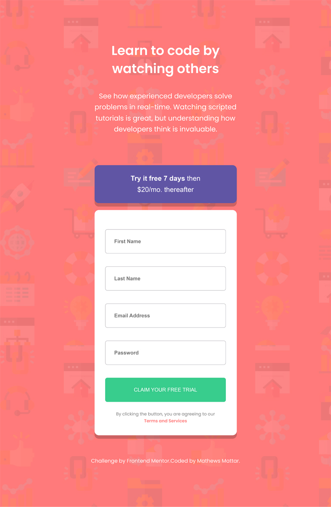
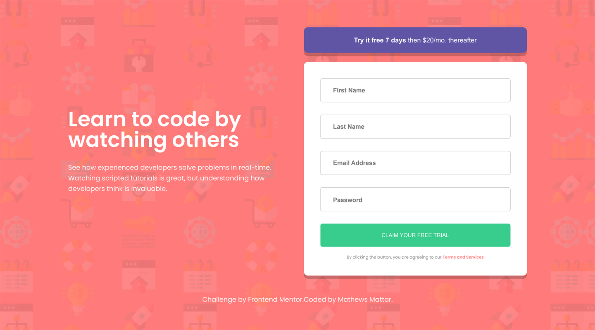

# Frontend Mentor - Intro component with sign up form

Esta é uma solução para o desafio da [Intro component with sign up form challenge on Frontend Mentor](https://www.frontendmentor.io/challenges/intro-component-with-signup-form-5cf91bd49edda32581d28fd1). Os desafios do Mentor de Frontend ajudam você a melhorar suas habilidades de codificação criando projetos realistas.

## Índice

- [Resumo](#resumo)
  - [Desafio](#desafio)
  - [Screenshot](#screenshot)
  - [Links](#links)
- [Processo](#processo)
  - [Construção](#construção)
  - [Aprendizado](#aprendizado)
- [Recursos](#recursos)
- [Autor](#autor)

## Resumo

Formulário de cadastro completo, deve-se cadastrar nome, sobrenome, email e senha. Validação e interação com os campos e botão de envio.

### Desafio

Os usuários devem ser capazes de:

- Visualizar o layout ideal para o site, dependendo do tamanha da tela do dispositivo;
- Estados de foco para todos os elementos interativos na página;
- Enviar seu endereço de e-mail usando um campo `input`;
- Receber mensagem de erro quando o formulário for enviado se:
  - Qualquer campo de `input` estiver vazio. A mensagem para este erro deve dizer *"nome do campo não pode estar vázio"*.
  - O endereço de email não está formatado corretamente, ou seja, um endereço de email deve ter uma estrutura `nome@host.tld`. A mensagem para este erro deve dizer: *"Parece que este não é um email"*

### Screenshot

<p align="center">
    </img>
</p>

------

<p align="center">
    </img>
</p>

------

<p align="center">
    </img>
</p>

### Links

- Site: [Sign Up Form](https://mathmattar.github.io/intro-component-with-signup-form/);

## Processo

### Construção

- Marcação semântica HTML5;
- Propriedades personalizadas CSS;
- Variáveis CSS;
- Flexbox;
- JavaScript.

### Aprendizado

Aprimorando minhas habilidades com a metodologia HTML BEM.

```HTML
     <section class="action">
            <button class="action__btn" id="btn-try-free"><span class="action__btn--strong">
                    Try it free 7 days</span> then $20/mo. thereafter
            </button>

            <section class="action__white-box">
                <form class="form" id="form" autocomplete="off">
                    <div class="form__input--position">
                        <input type="text" class="form__input--first" id="first-name" placeholder="First Name">
                        <div class="error__alert--first" id="error__alert"></div>
                        
                    </div>

                    <div class="form__input--position">
                        <input type="text" class="form__input--last" id="last-name" placeholder="Last Name">
                        <div class="error__alert--last" id="error__alert"></div>
                        
                    </div>

                    <div class="form__input--position">
                        <input type="email" class="form__input--email" id="email" placeholder="Email Address">
                        <div class="error__alert--email" id="error__alert"></div>
                        
                    </div>

                    <div class="form__input--position">
                        <input type="password" class="form__input--password" id="password" placeholder="Password">
                        <div class="error__alert--password" id="error__alert"></div>
                        
                    </div>

                    <button class="form__submit" id="submit">
                        Claim your free trial
                    </button>
                </form>

                <p class="action__terms">
                    By clicking the button, you are agreeing to our
                    <a href="" class="action__terms--link">Terms and Services</a>
                </p>
            </section>
        </section>
```

Aprimorando e me adaptando na utilização de váriaveis CSS.

```css
:root {
  /* images */
  --background-image-desktop: url(../../assets/images/bg-intro-desktop.png);
  --background-image-mobile: url(../../assets/images/bg-intro-mobile.png);
  /* color */
  --color-primary-red: hsl(0, 100%, 74%);
  --color-primary-green: hsl(154, 59%, 51%);
  --color-accent-blue: hsl(248, 32%, 49%);
  --color-neutral-dark-blue: hsl(249, 10%, 26%);
  --color-neutral-dark-blue-opacity: hsla(249, 10%, 26%, 0.3);
  --color-neutral-grayish-blue: hsl(246, 25%, 77%);
  --color-neutral-white: #fff;
  --color-neutral-black-opacity: rgb(0, 0, 0, 0.5);
  /* font size */
  --size-title-desktop: 5rem;
  --size-form-input-desktop: 1.5rem;
  --size-form-input-password: 2rem;
  --size-title-mobile: 3rem;
  --size-action-term-mobile: 1rem;
  --size-16: 1.6rem;
  --size-12: 1.2rem;
  /* font weight*/
  --regular: 400;
  --medium: 500;
  --semi-bold: 600;
  --bold: 700;
  /* line height */
  --line-height-16: 1.6;
  /* width */
  --width-action-desktop: 54rem;
  --width-form-input-desktop: 42.8rem;
  --width-form-submit-desktop: 46rem;
  --width-mobile: 100%;
  /* height */
  --height-action-btn-desktop: 6.2rem;
  --height-form-input-desktop: 5.6rem;
  --height-action-btn-mobile: 8.8rem;
  /* padding */
  --white-box-padding: 2rem 4rem 4rem;
  --form-input-padding: 0 0 0 3rem;
  --body-padding-mobile: 9.6rem 2.4rem 0;
  --action-btn-padding-mobile: 0 6rem;
  --action-white-box-padding-mobile: 2.5rem;
  --form-input-padding-mobile: 0 0 0 2rem;
  --action-term-padding-mobile: 0 2.4rem;
  --attribution-padding-mobile: 0 5rem 9.8rem;
  /* margin */
  --action-margin: 0 0 2.2rem 0;
  --text-title-margin: 0 0 3rem 0;
  --form-input-margin: 2rem 0 0 0;
  --text-paragraph-margin-bottom-mobile: 7rem;
  --action-btn-margin-bottom: 1.6rem;
  /* border */
  --border-none: none;
  --border-form-input: 1px solid var(--color-neutral-dark-blue);
  --border-error: 1px solid var(var(--color-primary-red));
  --border-radius-action: 1rem;
  --border-radius-form-input-submit: 0.5rem;
  /* shadow */
  --shadow: 0 8px 0px 0px rgb(0, 0, 0, 0.2);
}
```

Verificação do formulário utilizando diferentes funções para cada resposabilidade.

```js
function checkInputs() {
  const firstNameValue = firstName.value.trim();
  const lastNameValue = lastName.value.trim();
  const emailValue = email.value.trim();
  const passwordValue = password.value.trim();

  if (firstNameValue === "") {
    errorAlert("error__alert--first", "First Name cannot be empty");
    errorIcon("error__image--one");
    errorBorder("form__input--first");
  } else if (checkName(firstNameValue) !== true) {
    errorAlert(
      "error__alert--first",
      "First name must contain more than three letters and no number"
    );
    errorIcon("error__image--one");
    errorBorder("form__input--first");
  } else {
    removeErrors(
      "error__alert--first",
      "error__image--one",
      "form__input--first"
    );
  }

  if (lastNameValue === "") {
    errorAlert("error__alert--last", "Last Name cannot be empty");
    errorIcon("error__image--two");
    errorBorder("form__input--last");
  } else if (checkName(lastNameValue) !== true) {
    errorAlert(
      "error__alert--last",
      "Last name must contain more than three letters and no number"
    );
    errorIcon("error__image--two");
    errorBorder("form__input--last");
  } else {
    removeErrors(
      "error__alert--last",
      "error__image--two",
      "form__input--last"
    );
  }
}
```

### Recursos

- [BEM: guia definitivo do padrão CSS mais famoso](https://desenvolvimentoparaweb.com/css/bem/)
- [Utilizando propriedades CSS personalizadas (variáveis)](https://developer.mozilla.org/pt-BR/docs/Web/CSS/Using_CSS_custom_properties)
- [Expressões Regulares](https://developer.mozilla.org/pt-BR/docs/Web/JavaScript/Guide/Regular_Expressions)
- [Recarregar URL](https://developer.mozilla.org/pt-BR/docs/Web/API/Location/reload)

## Autor

- Site pessoal - [Mathews Mattar](https://www.linkedin.com/in/mathewsmattar/)
